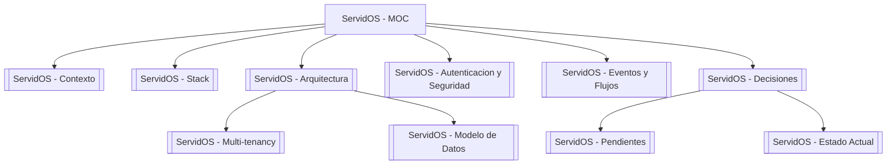

# ServidOS — Mapa de Contenido

> [!abstract] Fuente de verdad
> Este MOC es el índice navegable de `PROJECT_CONTEXT.md`. Cada sección es una nota atómica con wikilinks bidireccionales. Si cambiás algo acá, el grafo de Obsidian lo refleja automáticamente.

Plataforma SaaS multi-tenant para restaurantes. Ver [[ServidOS - Contexto]] para alcance MVP y principios.

## Navegación

### Fundamentos
- [[ServidOS - Contexto]] — qué es, alcance MVP, principio 1:1, YAGNI
- [[ServidOS - Stack]] — Spring Modulith, PostgreSQL, DBML, BPMN, OWASP
- [[ServidOS - Arquitectura]] — monolito modular, estructura por módulo, boundaries

### Datos y Aislamiento
- [[ServidOS - Modelo de Datos]] — tablas, correcciones cerradas, `restaurant-saas-schema.dbml`
- [[ServidOS - Multi-tenancy]] — shared schema + `restaurante_id` denormalizado

### Seguridad y Flujos
- [[ServidOS - Autenticacion y Seguridad]] — identidad, JWT, Broken Access Control, boundaries JPA
- [[ServidOS - Eventos y Flujos]] — kitchen como proyección, WebSockets, reporting por eventos

### Gobierno del proyecto
- [[ServidOS - Decisiones]] — resumen de decisiones cerradas
- [[ServidOS - Pendientes]] — dudas abiertas y próximos pasos
- [[ServidOS - Estado Actual]] — qué está hecho y qué sigue
- [[ServidOS - Módulos Implementados]] — catálogo de módulos vertical slice (catalog → kitchen)

> [!tip] Método de trabajo
> BPMN ↔ schema cross-referencing. Ver [[ServidOS - Eventos y Flujos#Método BPMN]] y [[ServidOS - Modelo de Datos#Correcciones cerradas]].

## Diagrama de módulos

## Queries útiles

![[ServidOS - Pendientes#Pendientes importantes]]
![[ServidOS - Estado Actual#Próximo trabajo]]

---
Fuente: `PROJECT_CONTEXT.md` v2026-08-27. Tags: #servidos #saas
