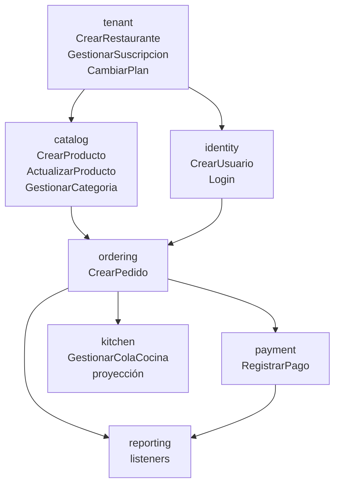

# ServidOS — Módulos Implementados

Parte de [[ServidOS - MOC]] · Estado: [[ServidOS - Estado Actual]] · Decisiones: [[ServidOS - Decisiones]]

> [!abstract] Patrón aplicado
> Todos los módulos siguen **enfoque A — vertical slice hexagonal**: `domain.crear()/actualizar()` (POJO puro + `BusinessException`) → `JPA Entity` (`@PrePersist/@PreUpdate`) → `Mapper` (`@Component`, nunca muta `restaurante_id`) → `Repository` (tenant `findBy...AndRestauranteId`) → `UseCase` (`@Service @Transactional`, `record Command` con `restauranteId` del `TenantContext`). Validación `null/blank` antes de DB.

## Mapa

## Catalog — Verde ✅

> [!success] Estado
> Implementado y revisado con 5 ciclos de review (NPE, hardcodeo `HABILITADO`, `updateEntity` sin `restaurante_id`).

- **Dominio:** `Producto.crear/actualizar` + `Categoria.crear` con `@Builder`, `BusinessException` — ver `BD.sql#producto` + `tiempo_preparacion` extra
- **Persistencia:** `ProductoJpaEntity` / `CategoriaJpaEntity` con `@PrePersist`, `unique(restaurante_id, nombre)`
- **Mappers:** `ProductoMapper` / `CategoriaMapper` — `toDomain` mapea `created_at/updated_at`, `updateEntity` nunca toca `restaurante_id`
- **UseCases:** `CrearProductoUseCase` (`restauranteId` del JWT), `ActualizarProductoUseCase` (vía `Producto.actualizar` + `mapper`), `GestionarCategoriaUseCase` (`Command` con `EstadoCategoria` tipado, `validar` antes de DB)
- **Specs:** `docs/superpowers/specs/2026-08-30-ordering-module-design.md` (plantilla), `BD.sql#producto`

^catalog

## Ordering — Verde ✅

> [!info] Patrón `Item` anidado
> `Command` con `record Item(productoId, cantidad, observacion)` dentro — `restauranteId` no viene del JSON.

- **Dominio:** `Pedido.crear` (estado variable desde front, default `PENDIENTE`, validación `MESA requiere mesaId`) + `DetallePedido.crear` (`cantidad>0`, `subtotal = precio*cantidad`)
- **Persistencia:** `PedidoJpaEntity` / `DetallePedidoJpaEntity` (`restaurante_id` denormalizado), `time_preparacion` solo en `Producto`
- **Repos:** `PedidoJpaRepository.findByPedidoIdAndRestauranteId`, `DetallePedidoJpaRepository.findByPedidoIdAndRestauranteId`
- **UseCase:** `CrearPedidoUseCase` — `Command(TipoPedido, EstadoPedido, mesaId, repartidorNombre, List<Item>)`, `validar` `null/blank` antes de DB, `productoId` validado con `existsByIdAndRestauranteId`, `precio` tomado de DB (anti-tamper), `total = sum(subtotales)`, `publish(PedidoCreadoEvent)`
- **Notas:** `estado` variable desde front (flexibilidad), `Item` de entrada sin `nombre` (el `nombre` se enriquece en la respuesta), `MESA` en vez de `LOCAL` por gestionabilidad

> [!question] Para revisar
> - ¿`Item` debería incluir `nombre` en la respuesta? No en el `Command` de entrada.
> - `vuelto` solo para `EFECTIVO` — ver [[ServidOS - Módulos Implementados#Payment — Verde]]

^ordering

## Tenant — Verde ✅

> [!tip] Suscripción como historial
> `fecha_inicio/fin` son `LocalDate` (no `LocalDateTime`), `estado` solo `ACTIVA/CANCELADA` (sin `INACTIVA` — vencimiento se calcula `fecha_fin - hoy`).

- **Dominio:** `Restaurante.crear(slug 3-100 regex, nombre 3-150)` + `Suscripcion.crear(restauranteId, planId, LocalDate, LocalDate)` (`fechaFin > fechaInicio`)
- **Entidades:** `RestauranteJpaEntity` (`slug` unique), `SuscripcionJpaEntity` (`LocalDate`)
- **Repos:** `RestauranteJpaRepository.existsBySlug`, `SuscripcionJpaRepository.findTopByRestauranteIdOrderByCreatedAtDesc`
- **UseCases:** `CrearRestauranteUseCase` (crea `Restaurante ACTIVO` + primera `Suscripcion ACTIVA hoy→hoy+30`, `publish(RestauranteCreadoEvent)`), `GestionarSuscripcionUseCase.suscribir/cancelar/renovar` ( `cancelar` = `UPDATE ACTIVA→CANCELADA`, `renovar` = `INSERT` nueva `ACTIVA` con `fechaInicio = vieja.fechaFin+1` si vigente), `CambiarPlanUseCase` (cierra `ACTIVA`, crea nueva con `nuevoPlanId`)
- **Plan:** `docs/superpowers/specs/2026-08-30-tenant-module-design.md`

^tenant

## Identity — Verde ✅ (JWT stub)

> [!warning] Seguridad deferida
> `JwtService.generate()` es stub `"stub-jwt"` — `HttpOnly + refresh` se enseña en sesión dedicada, no automatizado. `SecurityConfig` solo expone `BCryptPasswordEncoder`.

- **Dominio:** `Usuario.crear(nombre, apellido, email lower, password_hash)` + `UsuarioRestaurante.crear(usuarioId, restauranteId, rolId)` — PK `usuario_id` compartida (1:1 MVP)
- **Entities:** `UsuarioJpaEntity` (`email` unique), `UsuarioRestauranteJpaEntity` (PK `usuario_id`)
- **Repos:** `UsuarioJpaRepository.findByEmail/existsByEmail`, `UsuarioRestauranteJpaRepository`
- **UseCases:** `CrearUsuarioUseCase` (`restauranteId` del `TenantContext`, `existsByEmail` lower, `rol exists`), `LoginUseCase` (mensaje genérico `"Credenciales inválidas"`, chequea `estado ACTIVO` de ambos, `jwtService.generate`)
- **Spec:** `docs/superpowers/specs/2026-08-30-identity-module-design.md`

^identity

## Payment — Verde ✅

> [!note] Izipay POS desconectado
> POS físico no habla con ServidOS en MVP — `RegistrarPago` solo *registra* el cobro ya hecho en el aparatito. Integración online (Link de pago) es fase 2.

- **Dominio:** `Pago.crear(pedidoId, restauranteId, usuarioId, metodoPago, monto, vuelto, referenciaExterna)` — `monto = pedido.total`, `vuelto = montoEntregado - total` solo si `EFECTIVO`, `referenciaExterna` nullable para voucher Izipay
- **Entity:** `PagoJpaEntity` (`vuelto` nullable, `fecha_pago`, `created_at/updated_at`)
- **Repo:** `PagoJpaRepository.existsByPedidoIdAndEstado`
- **UseCase:** `RegistrarPagoUseCase` — `Command(pedidoId, metodoPago, montoEntregado, referenciaExterna)` + `restauranteId/usuarioId` del `TenantContext`, valida `pedido` del tenant y `ya pagado`, `publish(PagoRegistradoEvent)`
- **Spec:** `docs/superpowers/specs/2026-08-30-payment-module-design.md`

^payment

## Kitchen — Diseño aprobado, sin WebSocket

> [!info] Proyección sin tabla
> `PreparacionPedido` es `proyección` (`@Builder`, no `@Entity`) — vista de `pedido.estado = EN_PREPARACION`.

- **Dominio:** `PreparacionPedido` (pedido_id, restaurante_id, mesa_id, tipoPedido, estado, items, total)
- **UseCase:** `GestionarColaCocinaUseCase.listarEnPreparacion/marcaListo` — solo lee `PedidoJpaRepository`, delega cambio de estado a `ordering`, `publish(PedidoPreparadoEvent)`, botón "Limpiar" es filtro frontend
- **WebSocket:** `WebSocketConfig` deferido — se enseña handshake + JWT + tenant + broadcast
- **Spec:** `docs/superpowers/specs/2026-08-30-kitchen-module-design.md` · **Plan:** `docs/superpowers/plans/2026-08-30-kitchen-module.md`

^kitchen

## Decisiones transversales

- [[ServidOS - Decisiones#Suscripcion sin INACTIVA|Suscripción sin INACTIVA]] — vencimiento calculado, `INACTIVA` removida
- `tiempo_preparacion` agregado a `BD.sql#producto` (extra)
- `TipoPedido.MESA` en vez de `LOCAL` por gestionabilidad
- `EstadoPedido` 4 estados (`PENDIENTE/PREPARACION/ENTREGA/CANCELADO`) se mantienen, no se migra a 6 de `BD.sql`
- `vuelto` nullable solo para `EFECTIVO`, `audit_log` deferido — ver [[ServidOS - Decisiones]]

## Links

- Specs: `docs/superpowers/specs/` — `ordering`, `tenant`, `identity`, `payment`, `kitchen`
- Plans: `docs/superpowers/plans/` — idem
- BD fuente: `BD.sql` + `PROJECT_CONTEXT.md`
- MOC: [[ServidOS - MOC]] · Estado: [[ServidOS - Estado Actual]]

---
Tags: #servidos #saas #modulos

