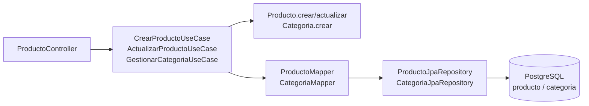

# Catalog

> [!success] Estado: Verde ✅ — Vertical slice completo
> Parte de [[ServidOS - Módulos Implementados]] · BD: `BD.sql#producto` · `BD.sql#categoria`

## Qué es

Módulo de **catálogo multi-tenant**: gestiona el menú del restaurante (productos y categorías). Cada restaurante tiene su catálogo aislado por `restaurante_id` — no ve productos de otro tenant. Es la base de `ordering` (un pedido referencia productos por `producto_id` plano).

## Qué hace

- **Categorías:** Crear y gestionar categorías (`HABILITADO/DESHABILITADO`) con unicidad `restaurante_id + nombre` (evita duplicados por tenant)
- **Productos:** Crear/actualizar productos con `nombre, descripción, imagen_url, precio >0, tiempo_preparacion, categoria (nullable), estado DISPONIBLE/AGOTADO`
- **Reglas:** Validación multi-tenant (nunca confía en `restaurante_id` del front), precio siempre >0, tiempo >0, nombre 3-150 chars

## Flujo principal

1. Controller recibe `Command` (sin `restaurante_id`) + `restauranteId` del `TenantContext` (JWT)
2. UseCase `validar()` primero `null/blank` sin DB, luego `existsByNombreAndRestauranteId` y `existsByCategoriaIdAndRestauranteId` (aislamiento)
3. Dominio `Producto.crear()` lanza `BusinessException` si viola invariantes
4. Mapper `toEntity` (new + setters, sin `Builder` en JPA) → `repository.save()` → `toDomain` de vuelta
5. `updateEntity` nunca muta `restaurante_id` (seguridad tenant)

## Clases clave

| Clase | Qué es | Relación |
|-------|--------|----------|
| `Producto` / `Categoria` | Dominio puro POJO `@Builder`, sin JPA | Usado por `ordering.DetallePedido` vía `producto_id` plano |
| `ProductoJpaEntity` / `CategoriaJpaEntity` | `@Entity` con `@PrePersist/@PreUpdate` para `created_at/updated_at` | Tabla `producto` con `tiempo_preparacion` extra (no está en BD.sql original) |
| `ProductoMapper` / `CategoriaMapper` | `@Component` con `toDomain/toEntity/updateEntity` | `updateEntity` ignora `restaurante_id` (no se cambia tenant) |
| `CrearProductoUseCase` / `ActualizarProductoUseCase` | `@Service @Transactional`, `record Command` | Consume `ProductoJpaRepository` + `CategoriaJpaRepository` |
| `GestionarCategoriaUseCase` | Crea categoría con `EstadoCategoria` tipado (no `String`) | Valida unicidad tenant antes de `Categoria.crear` |

## Relaciones con otros módulos

- **→ `ordering`:** `ordering.DetallePedido.producto_id` es `Long` plano que referencia `catalog.producto_id` — validado con `existsByProductoIdAndRestauranteId` (sin `@ManyToOne` para no romper boundary Modulith)
- **← `tenant`:** necesita `restaurante_id` existente (no crea productos huérfanos)
- **→ `reporting`:** `Producto` no publica eventos, pero su precio se usa para calcular `DetallePedido.subtotal` en `ordering`

## Decisiones

- `tiempo_preparacion` agregado a `BD.sql#producto` como `int nullable`
- `EstadoProducto DISPONIBLE/AGOTADO` y `EstadoCategoria HABILITADO/DESHABILITADO` se mantienen (alias de `activo/inactivo`)
- `Command` no incluye `restaurante_id` — anti Broken Access Control

## Links
- Detalle: [[ServidOS - Módulos Implementados#Catalog — Verde]] · [[ServidOS - Modelo de Datos]] · [[ServidOS - Multi-tenancy]]
