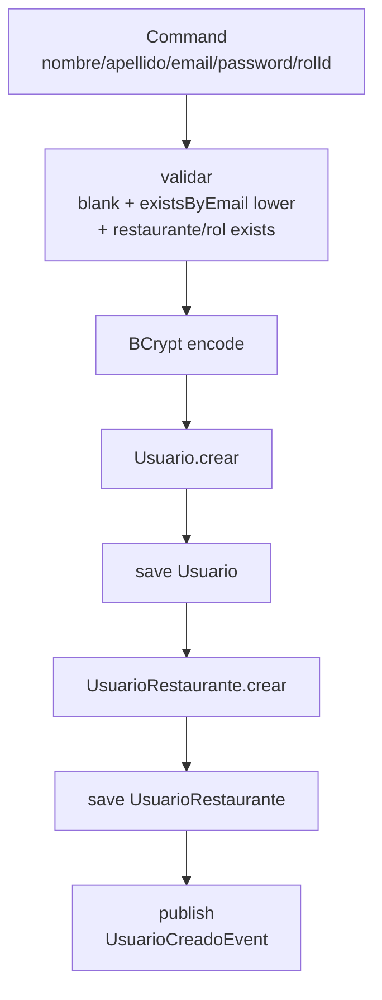

# Identity

> [!warning] Estado: Verde ✅ — JWT stub
> Parte de [[ServidOS - Módulos Implementados]] · Seguridad `HttpOnly + refresh` deferida para clase senior→junior

## Qué es

Módulo de **identidad y acceso**: `Usuario` (identidad pura, `email` único global) + `UsuarioRestaurante` (vínculo tenant + rol) con PK compartida `usuario_id` (1:1 MVP, upgradable a M:N cambiando PK a compuesta). No existe `Empleado` como entidad — es `Usuario + Rol + Restaurante`.

## Qué hace

- **Crear usuario:** `Usuario.crear(nombre, apellido, email lower, password_hash)` + `UsuarioRestaurante.crear(usuarioId, restauranteId, rolId)` en una transacción. `restauranteId` viene del `TenantContext` del admin que crea (no del JSON)
- **Login:** Valida `email/password`, `estado ACTIVO` de ambos, genera JWT con `restaurante_id` + `rol` en claim. Mensaje genérico `"Credenciales inválidas"` para no filtrar si el email existe (OWASP)
- **Roles:** `RolRestaurante` catálogo de lectura (`ADMIN, MOZO, COCINA` etc.)

## Flujo CrearUsuario

## Clases clave

| Clase | Qué es | Nota |
|-------|--------|------|
| `Usuario` | Dominio `@Builder`, `crear()` con `email` regex | `password_hash` ya hasheado, `estado ACTIVO/INACTIVO` |
| `UsuarioRestaurante` | Dominio `@Builder`, `crear()` | PK `usuario_id` simple fuerza 1:1 |
| `UsuarioJpaEntity` | `@Entity @Table(usuario, unique email)` | `email` unique global (login es global, contexto se resuelve después) |
| `UsuarioRestauranteJpaEntity` | `@Entity @Table(usuario_restaurante)` | `@Id usuario_id` FK a `usuario`, con `restaurante_id` + `rol_restaurante_id` |
| `UsuarioMapper` | `toDomain/toEntity` | Mapea 9 campos |
| `CrearUsuarioUseCase` | `@Service @Transactional` | `restauranteId` param tenant |
| `LoginUseCase` | `@Service` | `PasswordEncoder.matches` + `JwtService.generate` |
| `JwtService` / `SecurityConfig` | **Stubs** — `generate()` devuelve `"stub-jwt"` | `HttpOnly + refresh + CSRF` se enseña aparte, no automatizado |

## Relaciones

- **← `tenant`:** `restaurante_id` y `rol_restaurante_id` deben existir — valida con `RestauranteJpaRepository` y `RolRestauranteJpaRepository`
- **→ `ordering`:** `ordering.Pedido.usuario_id` es `Long` plano que referencia `identity.usuario` — no `@ManyToOne`
- **→ `payment`:** `payment.Pago.usuario_id` (quien cobró) también plano
- **→ `shared`:** `TenantFilter` lee JWT de cookie `HttpOnly` y pone `restaurante_id` en `TenantContext` para todos los UseCases
- **Eventos:** `UsuarioCreadoEvent` para `reporting` futuro

## Decisiones

- `email` único a nivel plataforma (login global)
- `JwtService` stub con `BCryptPasswordEncoder` bean ya expuesto — implementación real con `access 15min + refresh 7d` deferida
- Sin `UsuarioPlataforma` en MVP (solo `UsuarioRestaurante`)

