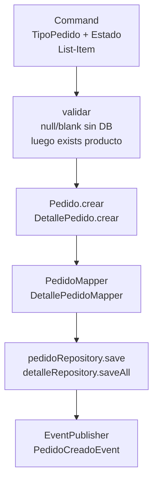

# Ordering

> [!success] Estado: Verde ✅ — Núcleo del negocio
> Parte de [[ServidOS - Módulos Implementados]] · BD: `BD.sql#pedido` + `BD.sql#detalle_pedido`

## Qué es

Módulo de **pedidos multi-tenant**: cabecera `Pedido` + renglones `DetallePedido` con `restaurante_id` denormalizado en ambas tablas (aislamiento sin depender de JOIN). Es el corazón que conecta `catalog` (qué se vende) con `kitchen` (cómo se prepara) y `payment` (cómo se cobra).

## Qué hace

- **Crear pedido** con `TipoPedido (DELIVERY/RECOJO/MESA)`, `mesa_id` (solo si `MESA`), `repartidor_nombre`, `observacion`, `estado` variable desde front (default `PENDIENTE`), y `List<Item>` (`productoId, cantidad, observacion`)
- **Validaciones:** `restauranteId` del `TenantContext`, `items` no vacío, `cantidad >0`, cada `productoId` existe y pertenece al mismo `restaurante` (via `catalog.ProductoJpaRepository`), `precio_unitario` tomado de la DB (anti-tamper), `subtotal = precio * cantidad`, `total = sum(subtotales)`
- **Eventos:** `publish(PedidoCreadoEvent)` para `kitchen` y `reporting`

## Flujo principal

1. Controller manda `Command` **sin** `restaurante_id` — UseCase lo recibe como param `Long restauranteId`
2. `validar()` primero chequea `tipoPedido/items` sin tocar DB, luego valida cada producto con `existsByIdAndRestauranteId`
3. `Pedido.crear(restauranteId, usuarioId, mesaId, tipoPedido, observacion, repartidor, estado, total)` — `estado` variable (flexibilidad front) con default `PENDIENTE` si `null`
4. Se guarda `Pedido` para obtener `pedido_id`, luego se crean `DetallePedido` con `precio` real de `Producto` y se calcula `total`
5. `pedido.setTotal(total)` + `save` + `publish`

## Clases clave

| Clase | Qué es | Nota |
|-------|--------|------|
| `Pedido` / `DetallePedido` | Dominio `@Builder`, `crear()` con `BusinessException` | `DetallePedido.subtotal` calculado, `restaurante_id` denormalizado |
| `PedidoJpaEntity` / `DetallePedidoJpaEntity` | `@Entity` con `@PrePersist` para `created_at/updated_at` | `pedido` tiene `tipo_pedido, estado, total`; `detalle_pedido` no tiene `updated_at` en BD pero lo mantenemos |
| `PedidoMapper` / `DetallePedidoMapper` | `toDomain/toEntity` (new + setters), `updateEntity` nunca toca `restaurante_id` | `toDomain` mapea `created_at/updated_at` |
| `CrearPedidoUseCase` | `@Service @Transactional`, `Command` con `Item` anidado | `Item(productoId, cantidad, observacion)` — entrada sin `nombre` (el nombre va en la respuesta, no en el Command) |
| `TipoPedido` | `DELIVERY/RECOJO/MESA` | `MESA` en vez de `LOCAL` por gestionabilidad (mapea a `mesa_id` nullable) |
| `EstadoPedido` | `PENDIENTE/PREPARACION/EN_PREPARACION/LISTO/ENTREGA/CANCELADO` | 4 originales + 2 para `kitchen`; no se migró a 6 de `BD.sql` |

## Relaciones

- **← `catalog`:** `DetallePedido.producto_id` plano → `Producto` — validado con `ProductoJpaRepository.existsByIdAndRestauranteId` (sin `@ManyToOne`)
- **→ `kitchen`:** `kitchen.PreparacionPedido` es proyección de `Pedido` con `estado = EN_PREPARACION` — `kitchen.GestionarColaCocina` solo lee `PedidoJpaRepository`
- **→ `payment`:** `payment.Pago.pedido_id` plano → `Pedido` — `RegistrarPago` valida `pedido` del tenant
- **→ `reporting`:** `PedidoCreadoEvent` escuchado por `PedidoCreadoListener`
- **← `tenant`/`identity`:** `restaurante_id` y `usuario_id` vienen del JWT, no del JSON

## Links
- Detalle: [[ServidOS - Módulos Implementados#Ordering — Verde]] · `BD.sql#pedido`
