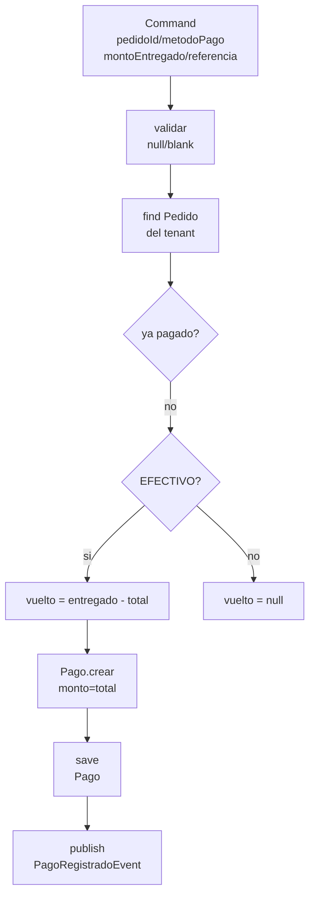

# Payment

> [!note] Estado: Verde ✅ — Registro manual, Izipay POS desconectado
> Parte de [[ServidOS - Módulos Implementados]] · BD: `BD.sql#pago`

## Qué es

Módulo de **cobros**: registra el pago de un `Pedido` por `restaurante_id` y `usuario_id` (quien cobró). No *procesa* el pago con tarjeta — lo *registra* después de que el POS físico (Izipay) pita "aprobado". `vuelto` solo existe para `EFECTIVO`.

## Qué hace

- **Registrar pago:** `Pago.crear(pedidoId, restauranteId, usuarioId, metodoPago, monto, vuelto, referenciaExterna)` con `monto = pedido.total`, `vuelto = montoEntregado - total` solo si `EFECTIVO` (si `YAPE/PLIN/TARJETA` con `vuelto` → error), `referenciaExterna` nullable para voucher Izipay
- **Validaciones:** `restauranteId/usuarioId` del JWT (no del JSON), `pedido` existe y es del tenant, `pedido` no `CANCELADO`, `ya pagado` (`existsByPedidoIdAndEstado PAGADO`), `montoEntregado >= total` si `EFECTIVO`, `estado` siempre `PAGADO`
- **Evento:** `publish(PagoRegistradoEvent)` para `reporting`

## Flujo RegistrarPago

## Clases clave

| Clase | Qué es | Nota |
|-------|--------|------|
| `Pago` | Dominio `@Builder`, `crear()` con `BusinessException` | `vuelto` validado, `estado PAGADO`, `fecha_pago now` |
| `MetodoPago` | `EFECTIVO/YAPE/PLIN/TARJETA_*` | Se mantiene tu enum actual (no `efectivo/billetera_digital/tarjeta` de `BD.sql`) |
| `EstadoPago` | `PENDIENTE/PAGADO/CANCELADO` | Se mantiene (no `anulado`) |
| `PagoJpaEntity` | `@Entity @Table(pago)` | `vuelto` nullable, `referencia_externa` 100 nullable, `fecha_pago` |
| `PagoJpaRepository` | `existsByPedidoIdAndEstado`, `findByPedidoIdAndRestauranteId` | Tenant + idempotencia |
| `PagoMapper` | `toDomain/toEntity` | Nunca muta `restaurante_id/pedido_id` |
| `RegistrarPagoUseCase` | `@Service @Transactional`, `Command` con `montoEntregado` | `monto` tomado de `Pedido.total` (anti-tamper) |

## Relaciones

- **← `ordering`:** `Pago.pedido_id` plano → `Pedido` — valida con `PedidoJpaRepository.findByPedidoIdAndRestauranteId`
- **← `tenant`/`identity`:** `restaurante_id` y `usuario_id` del `TenantContext`
- **→ `reporting`:** `PagoRegistradoEvent` escuchado por `PagoRegistradoListener`
- **↔ `izipay`:** Desconectado en MVP — el mozo elige `metodoPago` manual y pega `referencia_externa` si quiere trazar el voucher. Integración online (Link de pago) es fase 2 — ver `developers.izipay.pe`

## Decisiones

- `vuelto` solo para `EFECTIVO`, `referencia_externa` opcional
- No se integra Izipay API en MVP (YAGNI) — registro manual

