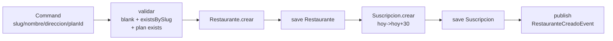

# Tenant

> [!success] Estado: Verde ✅ — Base del multi-tenancy
> Parte de [[ServidOS - Módulos Implementados]] · BD: `BD.sql#restaurante` + `BD.sql#suscripcion`

## Qué es

Módulo **SaaS**: `Restaurante` (tenant) + `Suscripcion` (ciclo de vida del plan) + `Plan/Funcionalidad` (catálogos de lectura). Todo el sistema filtra por `restaurante_id` — tenant es la raíz de confianza.

## Qué hace

- **Crear restaurante:** `Restaurante.crear(slug, nombre, direccion)` con `slug` `^[a-z0-9-]+$` 3-100 unique + `estado ACTIVO`, y primera `Suscripcion ACTIVA` (`fecha_inicio=hoy`, `fecha_fin=hoy+30` días del plan)
- **Gestionar suscripción (3 opciones):**
  - `suscribir` — solo si no tiene `ACTIVA` vigente
  - `cancelar` — `UPDATE ACTIVA → CANCELADA` (no `DELETE`)
  - `renovar/extender` — desbloqueado solo si hay `ACTIVA`; `INSERT` nueva `ACTIVA` con `fechaInicio = vieja.fechaFin+1` si vigente sino `hoy` (preserva historial)
- **Cambiar plan:** Cierra `ACTIVA` actual a `CANCELADA`, crea nueva `ACTIVA` con `nuevoPlanId` + 30 días, `publish(PlanCambiadoEvent)`

## Flujo CrearRestaurante

## Clases clave

| Clase | Qué es | Nota |
|-------|--------|------|
| `Restaurante` | Dominio `@Builder`, `crear()` con regex slug | `estado ACTIVO/INACTIVO` alias de `activo/inactivo` |
| `Suscripcion` | Dominio `@Builder`, `crear()` con `LocalDate` | `fecha_inicio/fin` son `LocalDate` (no `LocalDateTime`), `estado` solo `ACTIVA/CANCELADA` (sin `INACTIVA` — vencimiento se calcula `fecha_fin - hoy`) |
| `RestauranteJpaEntity` | `@Entity @Table(restaurante, unique slug)` | `@PrePersist` |
| `SuscripcionJpaEntity` | `@Entity @Table(suscripcion)` | `fecha_inicio/fin` `LocalDate` |
| `RestauranteMapper` / `SuscripcionMapper` | `toDomain/toEntity` | `updateEntity` nunca toca `restaurante_id` |
| `CrearRestauranteUseCase` | `@Service @Transactional` | Crea restaurante + suscripción en una transacción |
| `GestionarSuscripcionUseCase` | 3 métodos transaccionales | `renovar` es `INSERT`, `cancelar` es `UPDATE` |
| `CambiarPlanUseCase` | `@Service` | Valida `plan exists ACTIVO`, cierra y abre nueva |

## Relaciones

- **→ `identity`:** `identity.UsuarioRestaurante.restaurante_id` FK → `tenant.restaurante` — `CrearUsuario` valida `restaurante exists`
- **→ `catalog/ordering/payment`:** Todos filtran por `restaurante_id` — si el restaurante se `CANCELA`, el acceso se corta (no automático por fecha, solo manual)
- **← `ordering`/`payment`:** No conocen `Plan`, solo `restaurante_id`
- **Eventos:** `RestauranteCreadoEvent`, `PlanCambiadoEvent` para `reporting` futuro

## Decisiones

- `INACTIVA` removida de `EstadoSuscripcion` — KISS, `vencimiento` calculado
- `LocalDate` vs `LocalDateTime` para `fecha_fin`
- `renovar` = `INSERT` nueva fila (historial), `cancelar` = `UPDATE`

